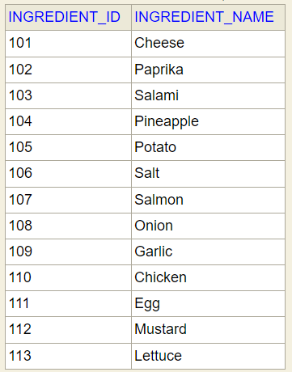
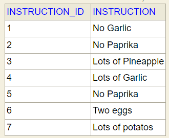
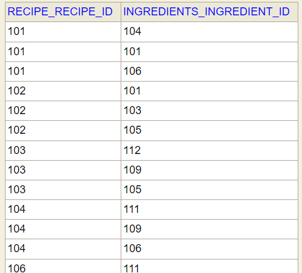
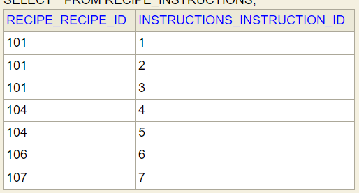
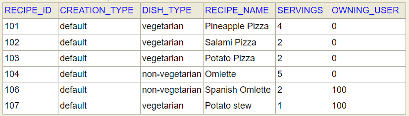
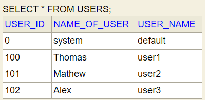

# GourmetOven App Components Description
Have a brief look at components and its responsibilities to collaborate the GourmetOven App requirements 

### RecipeController
Entry point for Rest API calls where user can access once APP runs on configured port  

* Please refer README.md for list of Rest end points

### ApplicationSecurityConfig
Enables Authentication for Users which allows restriction on CRUD operations for default/user-defined recipes. 

### GourmetOvenService
Service class which provides below responsibilities:

* Validates the rest API call input data receives as DTOs
* Fetch data from DB based on search/requests received
* Validates and verifies the operation is allowed for requested User
* Respond back DTO data to end user

### Repository
Different JPA interfaces created to achieve efficient CRUD operation based User requests:

* IngredientRepository - To List/validate/Map Ingredients.

* InstructionRepository - To List/validate/Map instructions to recipe.

* RecipeIngredientsMappingRepository - Map existing Ingredients to Recipes on create/update/delete.

* RecipeInstructionMappingRepository - Map Instructions to each Recipe.

* RecipeRepository - To handle CRUD operations and validate recipes.

* UserRepository - To get existing users details.

